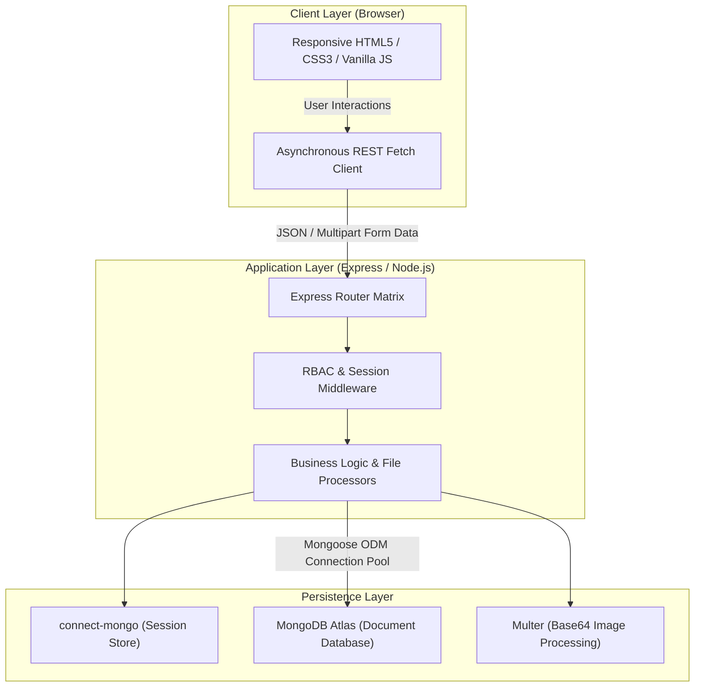
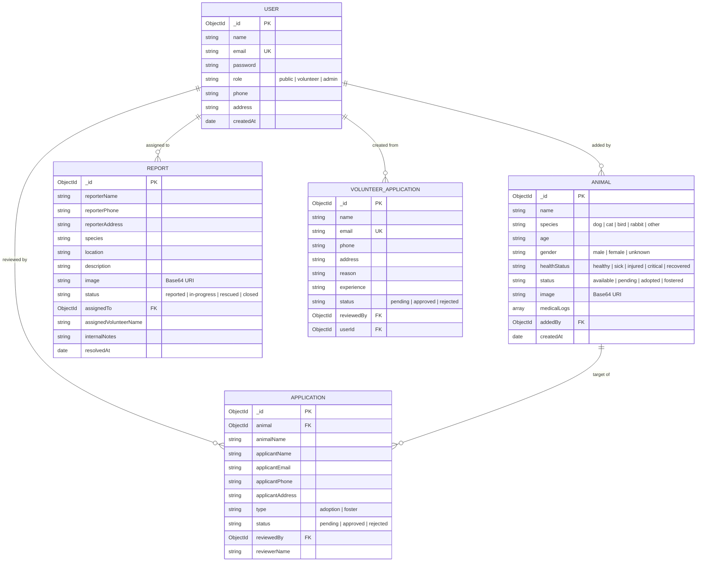

# Animal Rescue & Shelter Management System

[](https://nodejs.org/)
[](https://expressjs.com/)
[](https://www.mongodb.com/atlas)
[](https://vercel.com/)
[](LICENSE)

> A full-stack web application developed for the **Web Application Development Lab** final project. The platform centralizes stray animal reporting, rapid volunteer rescue dispatch, medical rehabilitation tracking, and an adoption/foster matching pipeline.

---

## Table of Contents
- [Project Overview](#-project-overview)
- [System Architecture](#-system-architecture)
- [Key Features & Modules](#-key-features--modules)
- [User Roles & Permissions (RBAC)](#-user-roles--permissions-rbac)
- [Database Design & Data Models](#-database-design--data-models)
- [REST API Reference](#-rest-api-reference)
- [Tech Stack](#-tech-stack)
- [Directory Structure](#-directory-structure)
- [Local Installation & Setup](#-local-installation--setup)
- [Environment Variables](#-environment-variables)
- [Production Deployment (Vercel)](#-production-deployment-vercel)
- [Academic Assessment Information](#-academic-assessment-information)

---

## Project Overview

### Problem Statement
Stray and injured animals in urban environments often suffer from delayed medical attention due to decentralized reporting mechanisms. Furthermore, shelter operations frequently face bottlenecks in coordinating rescue efforts, managing adoption applications, keeping transparent veterinary logs, and vetting volunteers.

### Proposed Solution
The **Animal Rescue & Shelter Management System** is an end-to-end web platform designed to streamline the entire rescue-to-adoption lifecycle:
1. **Citizens** can swiftly submit geo-tagged incident reports accompanied by photo evidence without barriers.
2. **Volunteers** can accept rescue dispatches, record real-time condition updates, and maintain medical treatment logs.
3. **Adopters** can search filtered catalogs and submit applications with home environment vetting.
4. **Administrators** possess centralized governance over user credentials, volunteer onboarding, and shelter analytics.

---

## System Architecture

The application adopts a modular **MVC (Model-View-Controller)** pattern with a decoupled client-server interface, optimized for **serverless environments (Vercel)** using MongoDB Atlas connection pooling and session persistence.



---

## Key Features & Modules

### 1. Stray Animal Rescue Reporting
- Public-facing emergency reporting form requiring location, animal species, incident description, and photo evidence.
- Multi-stage status lifecycle: `reported` ➔ `in-progress` ➔ `rescued` ➔ `closed`.
- Internal dispatcher notes and volunteer assignment tracking.

### 2. Adoption & Foster Pipeline
- Filterable animal catalog with real-time query parameters (species, health status, availability).
- Comprehensive adoption/foster screening form capturing applicant home type, experience, and pet compatibility.
- Application status workflow: `pending` ➔ `approved` ➔ `rejected` with reviewer audit logs.

### 3. Veterinary & Medical Care Journaling
- Detailed timeline logs associated with individual animal profiles.
- Records treatment procedures, diagnoses, medication notes, and attending volunteer identity.

### 4. Volunteer Onboarding & Management
- Public volunteer application portal collecting experience, motivation, and contact details.
- One-click administrator approval with automated account generation and role elevation.

### 5. Authentication & Session Security
- Cryptographic password hashing using `bcryptjs` (salt factor 10).
- Persistent serverless sessions backed by MongoDB (`connect-mongo`) with `HttpOnly` and `SameSite` protections.
- Secret code verification layer for administrative access.

---

## User Roles & Permissions (RBAC)

| Capability / Module | Public Visitor | Registered User | Volunteer | Administrator |
| :--- | :---: | :---: | :---: | :---: |
| Browse Animals & Search/Filter | ✔️ | ✔️ | ✔️ | ✔️ |
| Submit Incident Rescue Report | ✔️ | ✔️ | ✔️ | ✔️ |
| Submit Adoption / Foster Request | ✔️ | ✔️ | ✔️ | ✔️ |
| Apply to Become a Volunteer | ✔️ | ✔️ | — | — |
| Manage Personal Profile & Password | ❌ | ✔️ | ✔️ | ✔️ |
| View Incident Reports & Dispatch Feed | ❌ | ❌ | ✔️ | ✔️ |
| Update Rescue Status & Internal Notes | ❌ | ❌ | ✔️ | ✔️ |
| Add Animals & Record Medical Logs | ❌ | ❌ | ✔️ | ✔️ |
| Review Adoption & Foster Applications | ❌ | ❌ | ✔️ | ✔️ |
| Review & Approve Volunteer Applicants | ❌ | ❌ | ❌ | ✔️ |
| Manage User Roles & Delete Animal Records | ❌ | ❌ | ❌ | ✔️ |

---

## Database Design & Data Models

The system leverages **MongoDB** via the **Mongoose ODM**. The schema architecture is organized across five collections:



---

## REST API Reference

### Authentication & Users (`/api/auth`)
| Method | Endpoint | Access | Description |
| :--- | :--- | :--- | :--- |
| `POST` | `/api/auth/register` | Public | Register new user account |
| `POST` | `/api/auth/login` | Public | Authenticate user & start session |
| `POST` | `/api/auth/logout` | Logged In | Terminate active session |
| `GET` | `/api/auth/me` | Public | Retrieve current authentication state |
| `GET` | `/api/auth/profile` | Logged In | Fetch logged-in user profile |
| `PUT` | `/api/auth/profile` | Logged In | Update user contact details |
| `PUT` | `/api/auth/profile/password` | Logged In | Update account password |
| `GET` | `/api/auth/users` | Admin | List all registered users |
| `PUT` | `/api/auth/users/:id/role` | Admin | Update user role (`public`/`volunteer`/`admin`) |
| `DELETE` | `/api/auth/users/:id` | Admin | Delete a user account |

### Animals & Care (`/api/animals`)
| Method | Endpoint | Access | Description |
| :--- | :--- | :--- | :--- |
| `GET` | `/api/animals` | Public | Fetch animals with species/status filters |
| `GET` | `/api/animals/stats` | Public | Retrieve shelter summary metrics |
| `GET` | `/api/animals/:id` | Public | Get detailed profile of single animal |
| `POST` | `/api/animals` | Volunteer/Admin | Register new animal with photo |
| `PUT` | `/api/animals/:id` | Volunteer/Admin | Update animal status/health |
| `POST` | `/api/animals/:id/medical` | Volunteer/Admin | Append new veterinary medical note |
| `DELETE` | `/api/animals/:id` | Admin | Remove animal record permanently |

### Rescue Reports (`/api/reports`)
| Method | Endpoint | Access | Description |
| :--- | :--- | :--- | :--- |
| `POST` | `/api/reports` | Public | Submit emergency stray animal report |
| `GET` | `/api/reports` | Volunteer/Admin | List all filed rescue reports |
| `PUT` | `/api/reports/:id` | Volunteer/Admin | Update status, assign volunteer, or add notes |
| `DELETE` | `/api/reports/:id` | Admin | Remove report record |

### Adoption & Volunteer Applications (`/api/applications`, `/api/auth`)
| Method | Endpoint | Access | Description |
| :--- | :--- | :--- | :--- |
| `POST` | `/api/applications` | Public | Submit adoption or foster application |
| `GET` | `/api/applications` | Volunteer/Admin | List all adoption applications |
| `PUT` | `/api/applications/:id` | Volunteer/Admin | Approve or reject adoption application |
| `POST` | `/api/auth/volunteer-apply` | Public | Apply for shelter volunteer position |
| `GET` | `/api/auth/volunteer-applications` | Admin | Review pending volunteer requests |
| `PUT` | `/api/auth/volunteer-applications/:id`| Admin | Approve/Reject volunteer & create user |

---

## Tech Stack

- **Runtime & Backend**: [Node.js](https://nodejs.org/), [Express.js](https://expressjs.com/)
- **Database & ODM**: [MongoDB Atlas](https://www.mongodb.com/atlas), [Mongoose 7.x](https://mongoosejs.com/)
- **Session Management**: [express-session](https://github.com/expressjs/session), [connect-mongo](https://github.com/jdesboeufs/connect-mongo)
- **Security & Encryption**: [bcryptjs](https://github.com/dcodeIO/bcrypt.js)
- **File Handling**: [Multer](https://github.com/expressjs/multer) (Memory storage, Base64 image encoding)
- **Frontend**: Semantic HTML5, CSS3 (Responsive Grid/Flexbox), Vanilla JavaScript (ES6+ async/await)
- **Cloud & Hosting**: [Vercel](https://vercel.com/) (Serverless Lambda runtime)

---

## Directory Structure

```text
animal-rescue/
├── api/
│   └── index.js              # Serverless entry point for Vercel
├── middleware/
│   └── auth.js               # RBAC authorization guards (isLoggedIn, isVolunteer, isAdmin)
├── models/
│   ├── Animal.js             # Animal entity & medical logs schema
│   ├── Application.js        # Adoption / foster application schema
│   ├── Report.js             # Rescue incident reports schema
│   ├── User.js               # User accounts & credentials schema
│   └── VolunteerApplication.js # Volunteer applicant schema
├── public/
│   ├── css/
│   │   └── style.css         # Responsive stylesheets & design tokens
│   └── js/
│       └── main.js           # Global navigation auth state observer
├── routes/
│   ├── animals.js            # Animal catalog & medical care endpoints
│   ├── applications.js       # Adoption & foster application endpoints
│   ├── auth.js               # Auth, profile, user & volunteer management
│   └── reports.js            # Rescue dispatch reporting endpoints
├── views/
│   ├── admin-dashboard.html  # System administration & user governance
│   ├── animals.html          # Public searchable adoption catalog
│   ├── apply.html            # Public adoption/foster submission page
│   ├── index.html            # Landing page with stats & quick forms
│   ├── login.html            # User & administrator sign-in portal
│   ├── profile.html          # User profile & password settings
│   ├── register.html         # Public account registration
│   ├── report.html           # Emergency rescue reporting form
│   ├── volunteer-apply.html  # Volunteer recruitment form
│   └── volunteer-dashboard.html # Volunteer dispatch & animal management
├── .env.example              # Environment variables template
├── .gitignore                # Git ignore configuration
├── package.json              # Project dependencies & scripts
├── server.js                 # Local Express server & middleware pipeline
├── vercel.json               # Serverless routing & static asset rules
└── README.md                 # Complete project documentation
```

---

## Local Installation & Setup

### Prerequisites
- [Node.js](https://nodejs.org/) (v18.0.0 or higher recommended)
- [Git](https://git-scm.com/)
- A free [MongoDB Atlas](https://www.mongodb.com/atlas) cluster connection string (or local MongoDB server)

### 1. Clone the Repository
```bash
git clone https://github.com/IT23005/animal-rescue.git
cd animal-rescue
```

### 2. Install Dependencies
```bash
npm install
```

### 3. Configure Environment Variables
Create a `.env` file in the project root directory:
```bash
cp .env.example .env
```
Fill in the required keys in `.env`:
```env
MONGODB_URI=mongodb+srv://<username>:<password>@cluster0.mongodb.net/animal-rescue?retryWrites=true&w=majority
SESSION_SECRET=your_super_secret_session_key_here
ADMIN_SECRET_CODE=RESCUE_ADMIN_2026
PORT=3000
IS_LOCAL=true
```

### 4. Run the Application
For development mode with automatic restarts:
```bash
npm run dev
```
For production mode:
```bash
npm start
```
Open your browser and navigate to: **`http://localhost:3000`**

---

## ⚙️ Environment Variables

| Variable | Required | Description | Example |
| :--- | :---: | :--- | :--- |
| `MONGODB_URI` | **Yes** | Connection string for MongoDB Atlas cluster | `mongodb+srv://...` |
| `SESSION_SECRET` | **Yes** | Cryptographic secret for signing session cookies | `a_strong_random_string` |
| `ADMIN_SECRET_CODE`| **Yes** | Security code required during Admin login | `ADMIN_SECRET_123` |
| `PORT` | Optional | Local server HTTP listening port (Default: `3000`) | `3000` |
| `IS_LOCAL` | Optional | Set to `true` when running on HTTP locally to avoid secure cookie blocks | `true` |

---

## Production Deployment (Vercel)

This project is built to deploy out-of-the-box on **Vercel**:

1. **Push to GitHub**:
   Ensure your latest code is committed and pushed to your GitHub repository.
2. **Import into Vercel**:
   Go to [Vercel Dashboard](https://vercel.com/) ➔ **Add New Project** ➔ Import `IT23005/animal-rescue`.
3. **Configure Environment Variables**:
   In project settings on Vercel, navigate to **Settings > Environment Variables** and add:
   - `MONGODB_URI`
   - `SESSION_SECRET`
   - `ADMIN_SECRET_CODE`
4. **Deploy**:
   Click **Deploy**. Vercel will build the serverless functions via `vercel.json` and host static files automatically.

---

## Academic Assessment Information

- **Course**: Web Application Development Lab
- **Project Title**: Animal Rescue & Shelter Management System
- **Student ID**: IT23005
- **Developer**: Mahfuzur Rahman
- **Repository**: [https://github.com/IT23005/animal-rescue](https://github.com/IT23005/animal-rescue)
- **Live Deployment**: Deployed on Vercel
